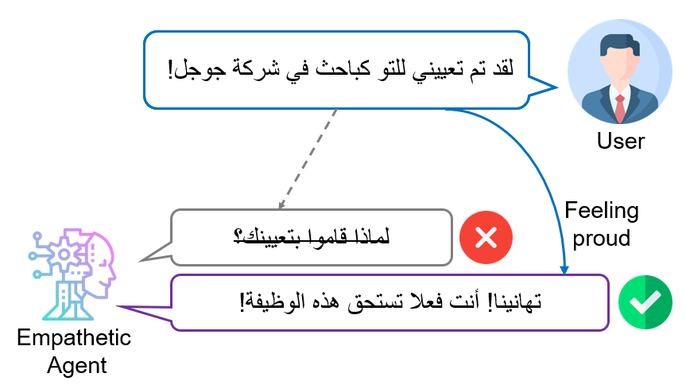

# Arabic-Empathetic-Chatbot




This repository contains a dataset of ~38K samples of open-domain utterances and empathetic responses in Modern Standard Arabic (MSA).

The dataset has been published in the paper [Empathy-driven Arabic Conversational Chatbot](https://www.aclweb.org/anthology/2020.wanlp-1.6/).

The repository also contains the code for the state-of-the-art BERT2BERT model for Arabic response generation, published in the paper [Empathetic BERT2BERT Conversational Model: Learning Arabic Language Generation with Little Data](https://www.aclweb.org/anthology/2021.wanlp-1.17/).


## Using our pre-trained BERT2BERT model

You can easily use our pre-trained [BERT2BERT model](https://www.aclweb.org/anthology/2021.wanlp-1.17/) from huggingface using the EncoderDecoderModel class:

```python
from transformers import EncoderDecoderModel, AutoTokenizer
tokenizer = AutoTokenizer.from_pretrained("tareknaous/bert2bert-empathetic-response-msa")
model = EncoderDecoderModel.from_pretrained("tareknaous/bert2bert-empathetic-response-msa")

model.to("cuda")
model.eval()
```
Install some dependencies for pre-processing MSA text using AraBERT preprocessor

```python
!pip install pyarabic
!pip install farasapy
!git clone https://github.com/aub-mind/arabert

from arabert.preprocess import ArabertPreprocessor
arabert_prep = ArabertPreprocessor(model_name="bert-base-arabert", keep_emojis=False)
```

Use the following function to perform prediction and post-processing:

```python
def generate_response(text):
  text_clean = arabert_prep.preprocess(text)
  inputs = tokenizer.encode_plus(text_clean,return_tensors='pt')
  outputs = model.generate(input_ids = inputs.input_ids.to("cuda"),
                   attention_mask = inputs.attention_mask.to("cuda"),
                   do_sample = True,
                   min_length=10,
                   top_k = 0,
                   top_p = 0.9,
                   temperature = 0.5)
  preds = tokenizer.batch_decode(outputs) 
  response = str(preds)
  response = response.replace("\'", '')
  response = response.replace("[[CLS]", '')
  response = response.replace("[SEP]]", '')
  response = str(arabert_prep.desegment(response))
  return response
```

Generated example: 

```python
input =  "!  انقطعت الكهرباء"
generate_response(input)

#Generated response
'يا رجل ، هل اتصلت بهم لإعلامهم بذلك ؟ '
```

**Note**: Make sure to play around with the sampling techniques (top-k or top-p) as they heavily influence the quality of your results.

Refer to this excellent blog for further infomation on sampling: 
https://huggingface.co/blog/how-to-generate

## If you use our dataset, make sure to cite our [paper](https://www.aclweb.org/anthology/2020.wanlp-1.6/):
```
@inproceedings{naous-etal-2020-empathy,
    title = "Empathy-driven {A}rabic Conversational Chatbot",
    author = "Naous, Tarek  and Hokayem, Christian  and Hajj, Hazem",
    booktitle = "Proceedings of the Fifth Arabic Natural Language Processing Workshop",
    month = dec,
    year = "2020",
    address = "Barcelona, Spain (Online)",
    publisher = "Association for Computational Linguistics",
    url = "https://www.aclweb.org/anthology/2020.wanlp-1.6",
    pages = "58--68",
}
```

## If you use our model, make sure to cite our [paper](https://www.aclweb.org/anthology/2021.wanlp-1.17/):
```
@inproceedings{naous-etal-2021-empathetic,
    title = "Empathetic {BERT}2{BERT} Conversational Model: Learning {A}rabic Language Generation with Little Data",
    author = "Naous, Tarek  and Antoun, Wissam  and Mahmoud, Reem  and Hajj, Hazem",
    booktitle = "Proceedings of the Sixth Arabic Natural Language Processing Workshop",
    month = apr,
    year = "2021",
    address = "Kyiv, Ukraine (Virtual)",
    publisher = "Association for Computational Linguistics",
    url = "https://www.aclweb.org/anthology/2021.wanlp-1.17",
    pages = "164--172",
}
```


## Contact
**Tarek Naous**: [Scholar](https://scholar.google.com/citations?user=ImyLv44AAAAJ&hl=en) | [Github](https://github.com/tareknaous?tab=repositories) |
[Linkedin](https://www.linkedin.com/in/tareknaous/) |  [Research Gate](https://www.researchgate.net/profile/Tarek_Naous?ev=hdr_xprf) | [Personal Wesbite](https://www.sites.google.com/view/tareknaous)
| tareknaous@gmail.com
